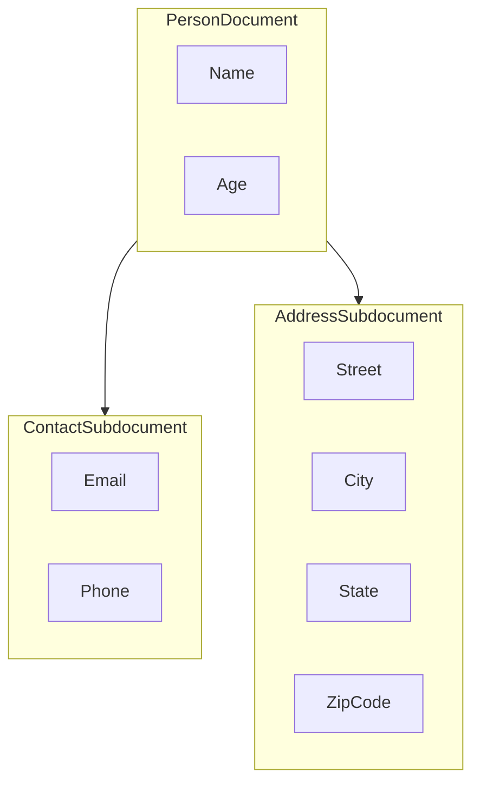

# MongoDB Comparison

To illustrate the contrast between the Collect approach and MongoDB, we will demonstrate the implementation of a data sample with nested data.

Here's a basic example of nested data as we naturally perceive it:

```javascript
const data = {
  Person: {
    Name: "John Galt", 
    Age: 30,
    Contact: {
      Email: "john.galt@example.com",
      Phone: "123-456-7890"
    },
    Address: {
      Street: "123 Main Street",
      City: "Anytown",
      State: "CA",
      ZipCode: "12345"
    }
  }
}
```

To store this data in MongoDB, we typically need to handle it on the backend. Below is an example of a MongoDB schema for this data:




This Mongoose schema represents the nested data structure and can be used to store and manage this data in MongoDB:
```javascript
const mongoose = require('mongoose');

// Define the Address schema
const addressSchema = new mongoose.Schema({
    Street: String,
    City: String,
    State: String,
    ZipCode: String,
});

// Define the Contact schema
const contactSchema = new mongoose.Schema({
    Email: String,
    Phone: String,
});

// Define the Person schema
const personSchema = new mongoose.Schema({
    Name: String,
    Age: Number,
    Contact: contactSchema,
    Address: addressSchema,
});

// Create a Mongoose model for "Person"
const Person = mongoose.model('Person', personSchema);

mongoose.connect('mongodb://localhost/yourdb', { useNewUrlParser: true, useUnifiedTopology: true });
```

And now we are good to go and ready to save this data to database:
```js
// Create a new Person document
const newPerson = new Person({
    Name: "John Galt",
    Age: 30,
    Contact: {
        Email: "john.galt@example.com",
        Phone: "123-456-7890"
    },
    Address: {
        Street: "123 Main Street",
        City: "Anytown",
        State: "CA",
        ZipCode: "12345"
    }
});

// Save the Person document to the database
newPerson.save((err) => {
    if (err) {
        console.error(err);
    } else {
        console.log('Person saved to the database.');
    }

    // Close the MongoDB connection when done
    mongoose.connection.close();
});
```

## Collect Approach

To store data in Collect, you only need to do the following:

```js
const data = {
    Person: {
        Name: "John Galt",
        Age: 30,
        Contact: {
            Email: "john.galt@example.com",
            Phone: "123-456-7890"
        },
        Address: {
            Street: "123 Main Street",
            City: "Anytown",
            State: "CA",
            ZipCode: "12345"
        }
    }
}

const options = {
    suggestTypes: true,
    generateLabels: true
};

fetch("https://api.collect.so/api/v1/collect/json", {
    headers: {
        token: "YOUR_SDK_TOKEN"
    },
    body: JSON.stringify({ payload: data, options }),
    method: "POST"
});
```

Collect will automatically assign **Labels** based on the data structure, generating 3 **Records** and 8 **Properties** 
with their corresponding data types.