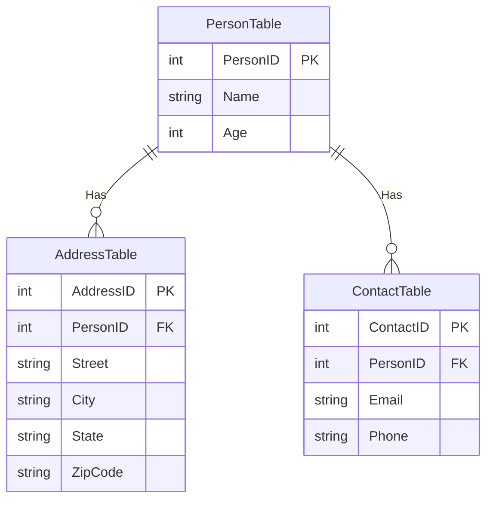

# PostgreSQL Comparison

PostgreSQL scheme example:

```mermaid
erDiagram
     PersonTable {
        int PersonID PK
        string Name
        int Age
    }
    AddressTable {
        int AddressID PK
        int PersonID FK
        string Street
        string City
        string State
        string ZipCode
    }
    ContactTable {
        int ContactID PK
        int PersonID FK
        string Email
        string Phone
    }

    PersonTable ||--o{ AddressTable : Has
    PersonTable ||--o{ ContactTable : Has
```