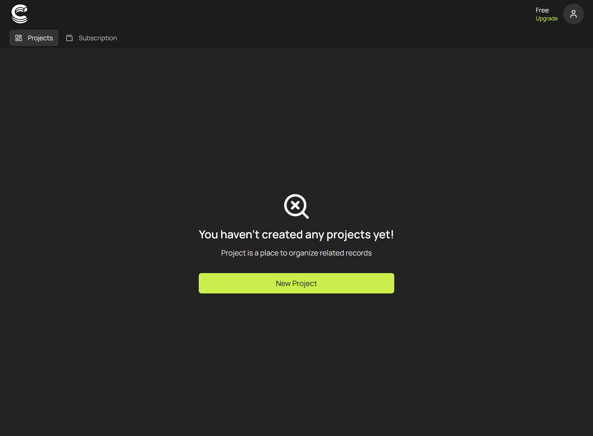
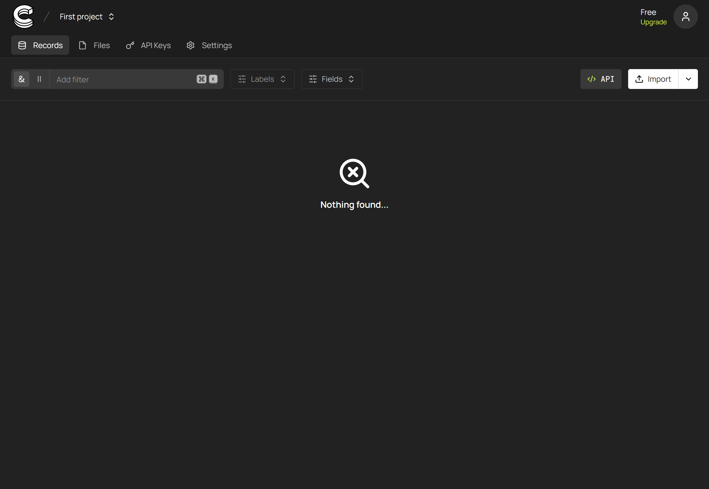
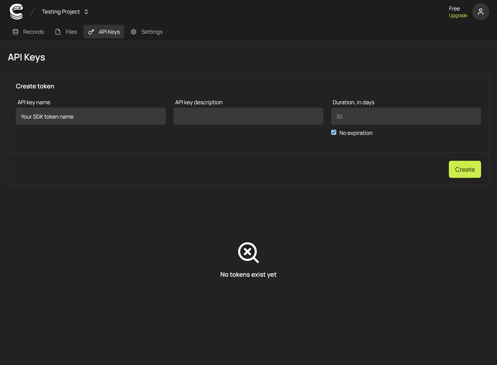

# Configuring Collect Dashboard (2 mins)

In this section, we'll walk through the process of registering for Collect and generating an API token necessary for using the Collect SDK. This token is essential for authenticating your application's requests to the Collect backend.

## Step 1: Sign Up for Collect

First, you need to create a Collect account. Go to the [Collect sign-up page](https://app.collect.so/signup) and register using your email address or via third-party authentication providers.

## Step 2: Create a Project

Once signed in, you'll be directed to the dashboard. To start working with Collect, you need to create a project where your records will be stored and managed.

- Click on the **Create Project** button to set up a new project. You might need to provide some basic information about your project, such as its name.

## Step 3: Generate an API Token

After creating your project, you'll be taken to its details page. Here, you can manage various aspects of your project, including API tokens.

- Navigate to the **Api Keys** tab at the top of the page.

- Inside the Api Keys section, click on **Create** to generate a new API token.

- Copy the generated token. This token will be used to authenticate your SDK instances and allow them to interact with your Collect project.

**Important:** Keep your API token secure and do not share it publicly. This token provides access to your Collect project and the data within it.

With your API token generated, you're now ready to initialize the Collect SDK in your application and begin creating and managing records programmatically. Proceed to the next section to learn about integrating the SDK into your project.